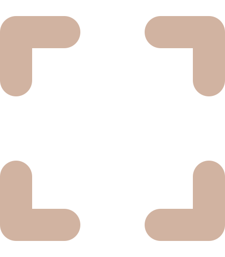
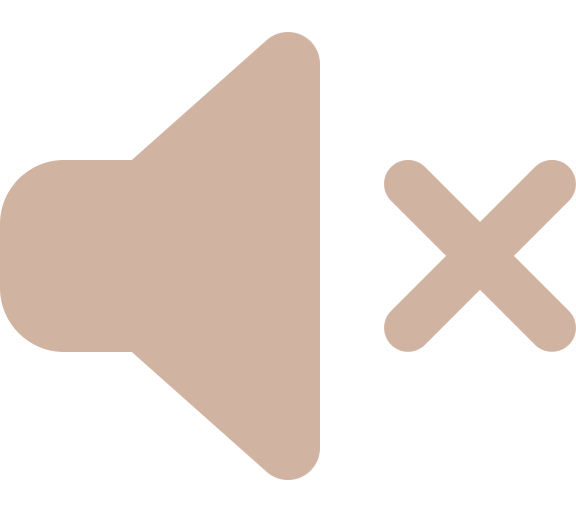

# COD

## Ajouter un nouveau projet

/!\ *remplacer x par le numéro du projet*

### AJouter la description du projet

Dans la section `descritpions` :

```html
<div id="description-x" class="description">
	<p class="description-title">Titre (date)</p>
	<p class="description-text">
		Description du projet.
	</p>
	<div class="description-techs">
		
		...
	</div>
</div>
```

### Ajouter le contenu du projet

Dans la section `projects` :

/!\ *mettre plusieurs section `project-title` si le titre a plusieurs mots*

**projet avec de images**

```html
<div id="x" class="project no-start-animation" onclick="swipeProject(x)">
	<p class="project-title">TITRE</p>
	<div class="project-images" data-left="0">
		
		...
	</div>
	<div class="project-buttons no-start-animation">
		<button class="project-button-swipe leftArrow no-start-animation" onclick="swipeImage(x, 1)">
			<svg xmlns="http://www.w3.org/2000/svg" viewBox="0 0 320 512"><path d="M41.4 233.4c-12.5 12.5-12.5 32.8 0 45.3l160 160c12.5 12.5 32.8 12.5 45.3 0s12.5-32.8 0-45.3L109.3 256 246.6 118.6c12.5-12.5 12.5-32.8 0-45.3s-32.8-12.5-45.3 0l-160 160z"/></svg>
		</button>
		<button class="project-button-swipe rightArrow no-start-animation" onclick="swipeImage(x, -1)">
			<svg xmlns="http://www.w3.org/2000/svg" viewBox="0 0 320 512"><path d="M278.6 233.4c12.5 12.5 12.5 32.8 0 45.3l-160 160c-12.5 12.5-32.8 12.5-45.3 0s-12.5-32.8 0-45.3L210.7 256 73.4 118.6c-12.5-12.5-12.5-32.8 0-45.3s32.8-12.5 45.3 0l160 160z"/></svg>
		</button>
	</div>
	<button class="project-button-param no-start-animation">
		
	</button>
</div>
```

**projet avec un vidéo**

```html
<div id="x" class="project no-start-animation" onclick="swipeProject(x)">
	<video class="project-video" loop playsinline muted>
		<source src="videos/projet.mp4" type="video/mp4">
	</video>
	<p class="project-title">TITRE</p>
	<button class="project-button-param no-start-animation">
		
	</button>
</div>
```

### Ajouter le point du projet

Dans la section `points` :

/!\ *enlever l'ancien `currentPoint`*

```html
<button id="pointx" class="point currentPoint" onclick="swipeProject(x)">
	<div class="point-indication">COD</div>
</button>
```

### Augmenter le nombre de projets dans le js

Dans `projectsScript.js` augmenter de 1 la valeur de la variable `MAX_PROJECT_ID`.